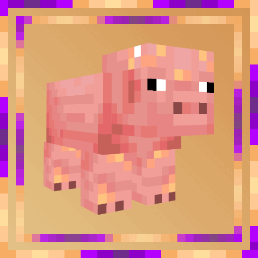

# AniTexLib

A light-weight library mod for Minecraft 1.19+, providing API for animations of mobs' textures

[API doesn't provide any content to Minecraft by its own except configurable pig-exampled-animation]

AniTexLib provides 2 variants of animator - static and dynamic

How to work with animators:
> To create static animator for your entity you have to:
- Register in public constructor of your main mod class TextureAnimator.addEntityToAnimate("Name of you main class".class,"modId of your mod","name of folder in /textures/ folder (f.e. entity/pig_animated)","name of texture + number of its index in animation queue (f.e. pig_animated)");

- Create in mentioned folder json file named like name of your texture + .png.json, and put their parameters of interval,frames' amount and base name of texture mentioned before

- Use TextureAnimator.getAnimatedTextureByName("your modId","full path to texture (f.e. textures/entity/pig_animated/)","basic name of textures (f.e.pig_animated)")

> To create dynamic animator for your entity you have to:

- Put in your texture folder textures and number them correct "base_name_of_texture" [Don't put .png after name]

- In getTextureLocation() method in entity's renderer put AnimateOptionsReader.getObjectWithoutUpdate(modId,pEntity.getUUID()) == null ? TextureAnimator.getManagedAnimatedTextureByName(modId,"","",conditionWhenStopAnimation,someStopFrame,someInterval,someAmountOfFrames,entityUUID) : TextureAnimator.getManagedAnimatedTextureByName(modId,null,null,null,null,null,null,pEntity.getUUID());

## Authors

[@sashakyotoz](https://www.github.com/sashakyotoz)

